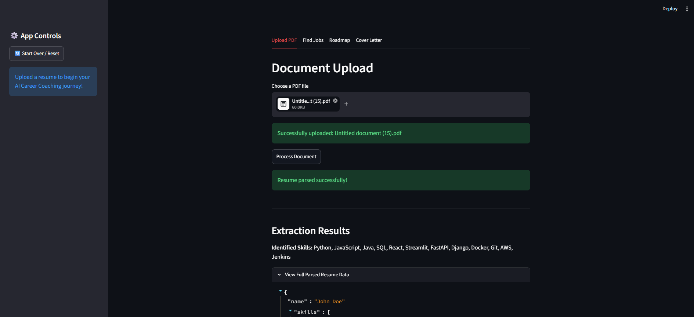
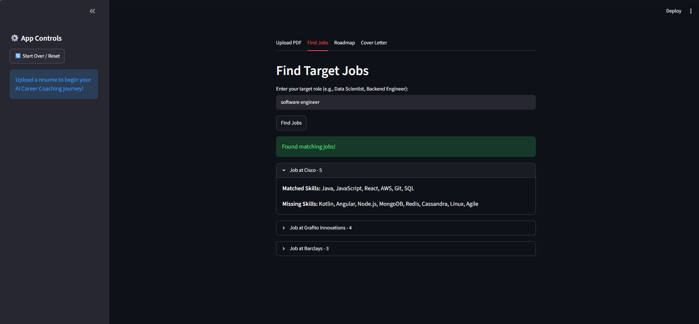
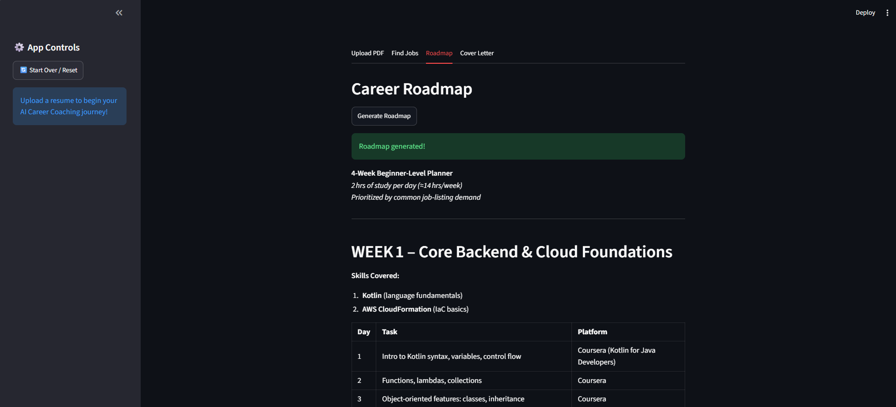
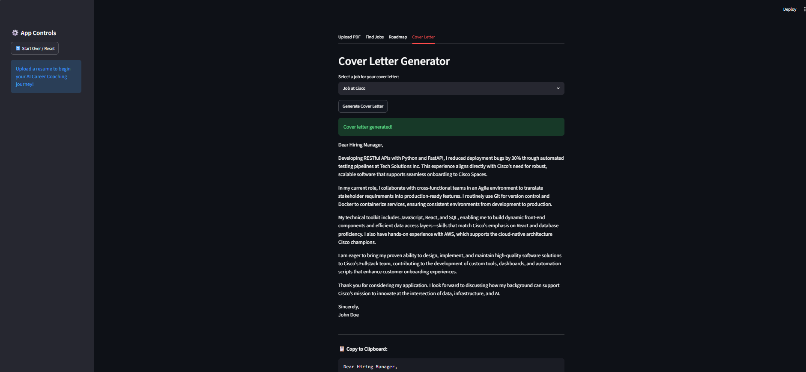

# AI_-CareerCoach

Navigating the job market is tough, but it doesn't have to be. **AI Career Coach** is an intelligent, state-driven application that analyzes your resume, finds semantically matching jobs, and generates custom learning roadmaps alongside tailored cover letters. 

## Demo 








---

## The Team

This project was built collaboratively by a team of 5 developers, each owning a distinct architectural module:

* **[Ritisha Sharma/Member 1]** — LangGraph Orchestrator & Routing
* **[Kashish Dhingra/Member 2]** — Resume Parsing Agent
* **[Priyanshi Saini/Member 3]** — RAG Pipeline & Jobs Agent
* **[Shraddha Tyagi/Member 4]** — Roadmap Generation & Cover Letter Agent
* **[Gargi Choudhary/Member 5]** — Streamlit Frontend & UI Integration

---

## Tech Stack

| Component | Technology |
| :--- | :--- |
| **Frontend UI** | Streamlit |
| **Agent Orchestration** | LangGraph |
| **LLM Provider** | OpenRouter (Free-tier open-source models) |
| **Vector Database** | ChromaDB (Persistent) |
| **Embeddings** | SentenceTransformers |
| **Job Search API** | JSearch API |

---

## Step-by-Step Setup Guide

Follow these steps to get the application running on your local machine.

### 1. Clone the Repository
To download this code, go to the top of this repository page, click the green **"<> Code"** button, and copy the web URL. Then, open your terminal and run:

```bash
git clone <PASTE_THE_URL_HERE>
cd <NAME_OF_THE_CLONED_FOLDER>
```

### 2. Set up a Virtual Environment (Highly Recommended)
Using a virtual environment keeps the project's dependencies isolated.

**For Mac/Linux:**
```bash
python3 -m venv venv
source venv/bin/activate
```

**For Windows:**
```bash
python -m venv venv
venv\Scripts\activate
```

### 3. Install Dependencies
With your virtual environment active, install all required packages:

```bash
pip install -r requirements.txt
```

### 4. Configure Environment Variables
You will need API keys to run the LLMs and Job Search. Create a new file named exactly `.env` in the **root directory** of the project and add your keys like this:

```text
OPENROUTER_API_KEY=your_openrouter_key_here
JSEARCH_API_KEY=your_jsearch_key_here
```

---

## How to Run the App

> **⚠️ CRITICAL:** You must run the application from the **root directory** of the project. Do not `cd` into the `ui/` folder.

Ensure your virtual environment is active, then run:

```bash
streamlit run ui/app.py
```


## Member 4 – Roadmap & Cover Letter Agent (Shraddha Tyagi)

Generates two career-prep deliverables from the shared `AgentState`:

- **4-week learning roadmap** based on the user's target role and skill gaps
- **Tailored cover letter** based on the user's resume and a target job listing

### Files

| File | Purpose |
|------|---------|
| `task/task_generate_roadmap.py` | Core LLM call that generates the roadmap |
| `task/task_generate_cover_letter.py` | Core LLM call that generates the cover letter |
| `agent/agent_roadmap.py` | LangGraph node wrapper — reads/writes `AgentState`, handles guards & errors |
| `agent/agent_cover_letter.py` | LangGraph node wrapper — reads/writes `AgentState`, handles guards & errors |
| `tests/test_agents.py` | Unit tests for both agent wrappers, including guard conditions |
| `tests/test_task_roadmap.py` | Unit tests for the raw roadmap generation function |
| `tests/test_task_cover_letter.py` | Unit tests for the raw cover letter generation function |
| `tests/eval_roadmap.py` | Manual eval — 5 varied roles, checks specificity & URL usage |
| `tests/eval_cover_letter.py` | Manual eval — 5 varied job listings, checks banned phrases & fabrication |
| `docs/member4_roadmap_agent.md` | Full documentation: guards, model config, testing, known issues |

### How it works

Both agents follow the same pattern: read the relevant fields from `AgentState`, run a guard
check, call OpenRouter (`openai/gpt-oss-20b:free`, `temperature=0`) with a retry on empty
responses, and return only the new key(s) they contribute (`{"roadmap": ...}` or
`{"cover_letter": ...}`) — never the full state — consistent with how the orchestrator merges
node outputs.

**Guards:**
- Empty `skill_gaps` → returns a friendly "already matches this role" message instead of calling the LLM.
- Missing `resume_json` / `job_listings`, or a `job_description` under 50 words → skips generation and sets `state["error"]` instead of crashing downstream.

See `docs/member4_roadmap_agent.md` for full details on model configuration, prompt design decisions, and known reliability tradeoffs with free-tier OpenRouter models.

### Status

✅ Both agents integrated as LangGraph nodes, guards tested, prompts evaluated on 5+ varied
inputs each. Blocked on full end-to-end testing with real (non-mock) job listing data pending
Member 3's resume/RAG pipeline output.

## Member 2 - Resume Agent

The Resume Agent handles resume processing in the initial stage of the AI Career Coach pipeline. It processes a user's resume and converts it into structured information that can be used by other agents.

### Resume Processing Flow

The resume processing workflow consists of extracting text from the uploaded PDF, converting the extracted text into structured resume information, generating embeddings, and storing the required details in the shared graph state.

## Implemented Components

### 1. PDF Parser (`tool/tool_pdf_parser.py`)

This module extracts text from uploaded resume PDFs using `pdfplumber`.

Implemented features:
- Extracts text from multi-page PDF resumes
- Validates that only PDF files are processed
- Handles pages where text extraction returns empty values
- Shows a warning when very little text is extracted, which can indicate an image-based/scanned resume

### 2. Resume Information Extraction (`task/task_extract_skills.py`)

This module converts extracted resume text into structured resume information using an LLM.

The extracted information includes:
- Name
- Skills
- Education
- Experience
- Projects
- Target Role

Additional handling:
- Missing fields are assigned default values to maintain a consistent JSON structure
- A fallback message is generated when no technical skills are detected

### 3. Resume Agent (`agent/agent_resume.py`)

The resume agent connects the parsing and extraction pipeline.

The `run(state)` function:
- Reads resume text from the shared state
- Generates structured resume JSON
- Generates resume embeddings
- Updates the graph state with:
  - `resume_json`
  - `skills`
  - `resume_embedding`

## Testing Done

The Resume Agent was tested on different resume formats, including:
- Single-column resumes
- Two-column resumes
- Resumes with tables
- Image-heavy resume layouts

Automated test cases were added in:

`tests/test_agent_resume.py`

The tests cover:
- JSON structure validation
- Empty skills fallback handling
- Skills format conversion
- Missing field handling
- Target role extraction

All implemented test cases are passing successfully.

## Known Limitations

- The pipeline is currently optimized for English resumes.
- Mixed language resumes may not always be extracted accurately.
- OCR support is not implemented, so fully image-based resumes may have limited extraction quality.
- Complex resume formatting can affect extracted text quality.